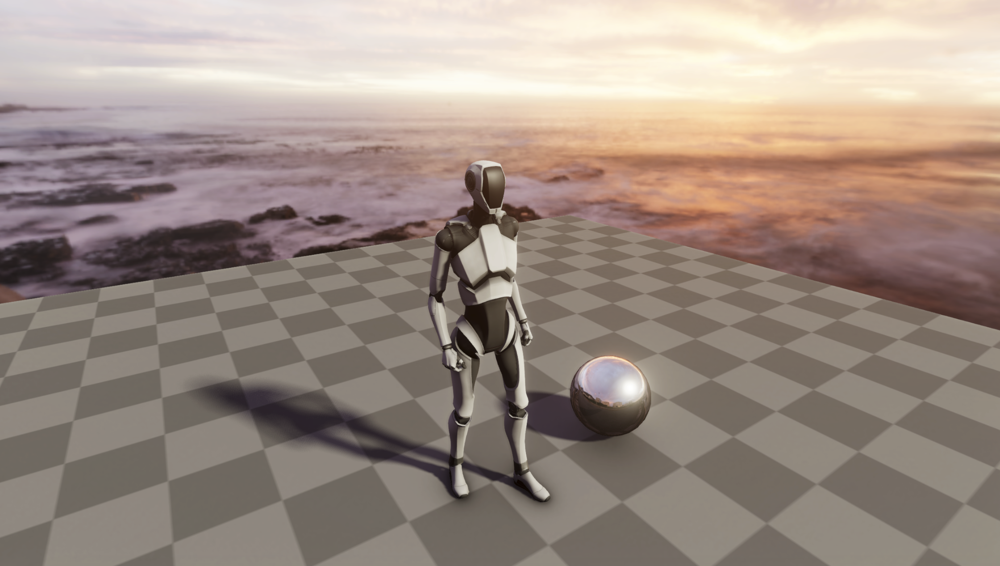

# Tiny Render Pipeline

## Description

A customized render pipeline for Unity SRP

## Feature

- [x] Physically Based Shading
- [x] Image Based Lighting
- [x] Shadow Mapping
  - [x] Cascade Shadow Maps
  - [x] PCF
  - [x] PCSS
- [x] Render Graph
- [x] Bloom
- [x] Scalable Ambient Obscurance
  - [x] Hierachical z with Rotated Grid Subsample
- [x] FXAA
- [x] TAA

## Planned

- [ ] SSR

## Reference

- [1] [filament](https://github.com/google/filament)
- [2] [SRP Core Documentation](https://docs.unity3d.com/Packages/com.unity.render-pipelines.core@latest)
- [3] [Scalable Ambient Obscurance](https://research.nvidia.com/publication/2012-06_scalable-ambient-obscurance)
- [4] [Unity Graphics](https://github.com/Unity-Technologies/Graphics)
