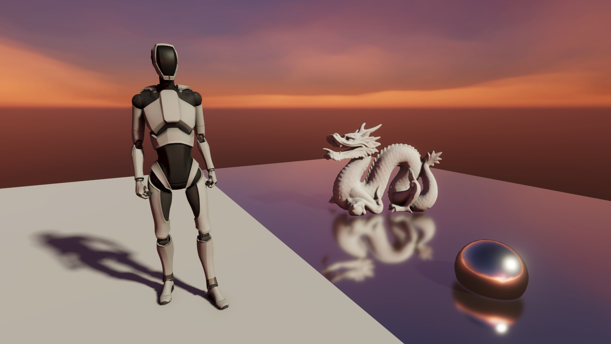

# Tiny Render Pipeline

## Description

A customized render pipeline for Unity SRP

## Feature

- [x] Physically Based Shading
- [x] Image Based Lighting
- [x] Shadow Mapping
  - [x] Cascade Shadow Maps
  - [x] PCF
  - [x] PCSS
- [x] Render Graph
- [x] Bloom
- [x] Scalable Ambient Obscurance
  - [x] Hierarchical-Z buffer for acceleration
- [x] Fast Approximate AA
- [x] Temporal AA
- [x] Screen Space Reflection
  - [x] Hierarchical-Z buffer for acceleration

## Planned

- [ ] Separable Subsurface Scattering
- [ ] Disney Burley Subsurface Scattering
- [ ] Z-Binning Tile Based Lighting
